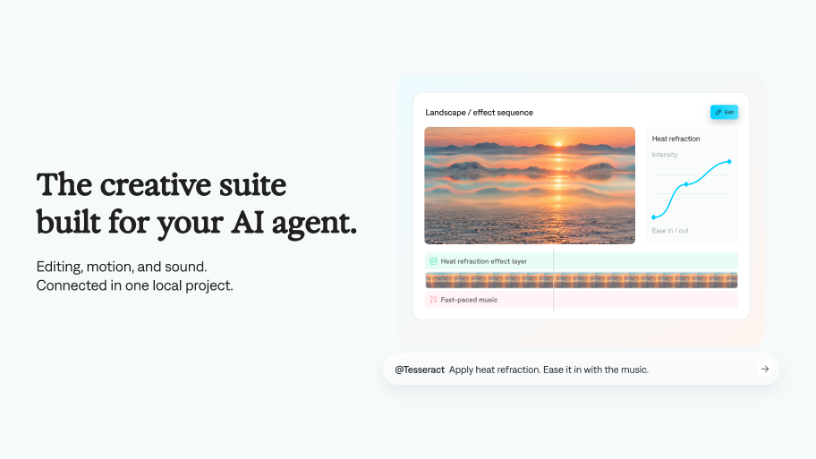

<p align="center">
  <picture>
    <source media="(prefers-color-scheme: dark)" srcset="docs/images/wordmark-dark.svg" />
    <source media="(prefers-color-scheme: light)" srcset="docs/images/wordmark-light.svg" />
    
  </picture>
</p>

<p align="center">
  <strong>The creative suite built for your AI agent.</strong><br />
  Editing, motion, and sound. Connected in one local project.
</p>

<p align="center">
  <a href="#get-started">Get started</a> ·
  <a href="#what-you-can-make">What you can make</a> ·
  <a href="#manual-downloads">Downloads</a> ·
  <a href="https://mirage.app">Mirage</a>
</p>



Tesseract brings professional creative tools into your agent workflow. Work with video layers, compositions, keyframes, and audio in one connected project. Preview the result, direct a revision, and render the finished video locally.

## Get started

**macOS or Windows, running locally.** In ChatGPT/Codex, use the desktop app with local execution. Linux, WSL, and cloud rendering are not supported.

### Install with one command

```sh
npx skills add mirage-hq/Tesseract
```

Choose both Tesseract skills and your agent. Requires Node.js/npm for this installer; the Tesseract CLI itself does not require Node.

Then [ask it to make a video](#what-you-can-make). The skills guide your agent through CLI setup when needed.

### Or let your agent install it

```text
Install the Tesseract skills from https://github.com/mirage-hq/Tesseract.
Follow their installation guide to set up the matching CLI for my
computer, verify its checksum, and confirm it runs.
```

### ChatGPT / Codex plugin

**Public plugin listing coming soon.** Use either setup option above for now.

### Manual downloads

**[Download a release →](https://github.com/mirage-hq/Tesseract/releases)** · **[Installation guide →](skills/tesseract-video/references/installation.md)**

| Download | Choose this for |
| --- | --- |
| Plugin ZIP | Both skills, packaged for OpenAI, Cursor, and Claude Code |
| CLI ZIP — `darwin-arm64` | Apple Silicon Mac |
| CLI ZIP — `darwin-x86_64` | Intel Mac |
| CLI ZIP — `windows-x86_64` | 64-bit Windows PC |
| Matching `.sha256` | Verify your ZIP before installing |

Use the CLI version required by your skills. Install either the plugin or the skills; you don't need both.

## What you can make

| Skill | Use it for |
| --- | --- |
| **Tesseract: Edit Video** | Cut footage, adjust framing, and combine dialogue and music. |
| **Tesseract: Motion Graphics** | Animate titles, typography, diagrams, and overlays. |

Attach your material, then copy a prompt:

```text
Use Tesseract to turn these clips into a 30-second product video.
Keep the opening quick, add a clean title, and finish on the logo.
```

```text
Use Tesseract to animate a diagram of these three steps.
Use our brand colors and keep the text editable.
```

Preview, then direct a revision:

```text
Make the title arrive earlier and soften the motion.
Render a preview before exporting the finished video.
```

Keep the editable `.tsrct` project for your next revision.

## Terms

[Product license](LICENSE.md) · [Tesseract terms](https://mirage.app/legal/tesseract-terms) · [Privacy policy](https://mirage.app/legal/privacy-policy) · [Third-party notices](THIRD_PARTY_NOTICES.md)

Each CLI ZIP includes third-party notices, licenses, and matching dependency sources.
